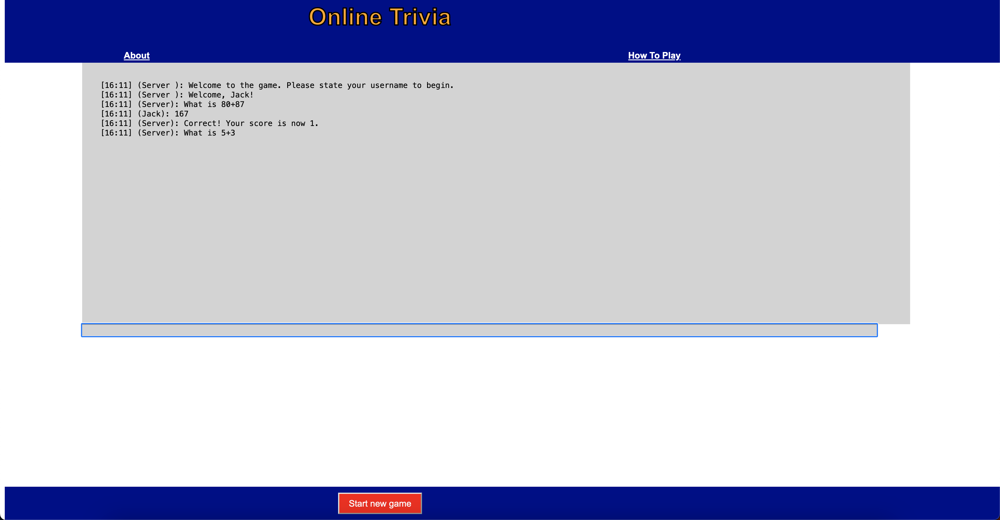

# Project Information
In this project, our group created a quiz game. In this game, the user gets asked questions from
server and the user has 3 attempts to get the question correct. First person to 10 correct answers
wins this game. This screenshot below shows how the game works: 

We added an about page so you may find out more about the members of the group who created this and a 
"How To Play" so that you can understand the game. There is also a Start New Game button so that you can start 
a new game after you reach your score of 10. 
# How To Run 
These set of instructions assume you have Java, IntelliJ, and Glassfish installed and configured on your machine.
1. Clone the repository onto your machine 
2. Go to src/main/java/com/example/wschatserverdemo and open QuizServer.java
3. Run a local glassfish server
4. go back to the main folder and open the webapp folder
5. Open the index.html file in your browser of choice
6. Enjoy the game!
# Other Resources
In this project we used: 
1. Glassfish 
2. IntelliJ 
3. Java
